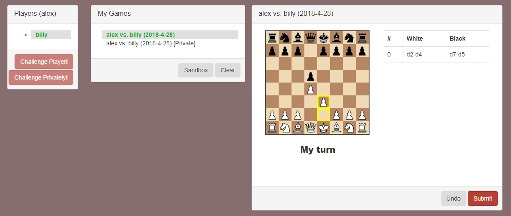

# Holochess - 

[](http://www.gnu.org/licenses/gpl-3.0)

**Code-Status**: Playable asynchronous P2P chess games with no time limit.

Holochess is a work in progress, sample application built with [Holochain](http://www.holochain.org) and javascript (jQuery).  
It's purpose is to learn and experiment holochain app building.

Chess logic is handled by [chess.js](https://github.com/jhlywa/chess.js)  
Board display is handled by [chessboard.js](https://github.com/oakmac/chessboardjs/)  
Overall UI is made with [Twitter Bootstrap v3.3.7](https://github.com/twbs/bootstrap)

## Screenshots



## Installation & Usage

Prerequiste: [Install holochain](https://github.com/metacurrency/holochain/#installation) on your machine and make sure you do the step to set the $GOPATH.


To see Holochess in action, the fastest way is to locally run 2 instances of Holochess and your own Bootstrap server.  
So download the latest release from [Holochess Release](https://github.com/ddd-mtl/holochess/releases), unzip it and make 2 copies of the contents into folders called *holochess1* and *holochess2*.  
Both folders will have a dna folder and a ui folder in each.

Firstly run the bootstrap server which will let each instance of Holochess know about its peers.  
The ```bs```  command is part of the Holochain install.  
If it doesn't work you probably need to set the $GO_PATH variable.
```
  bs
```
You will get a response like
```
2018/01/11 11:24:03 app version: 0.0.2; Holochain bootstrap server
2018/01/11 11:24:03 starting up on port 3142
```

Now start up Holochess in each folder.
```
  cd holochess1
  hcdev -no-nat-upnp -port=6001 -agentID=alex -mdns=true -bootstrapServer=localhost:3142 web 3141

  cd ..
  cd holochess2
  hcdev -no-nat-upnp -port=6002 -agentID=billy -mdns=true -bootstrapServer=localhost:3142 web 4141
```
You will see a response like:
```
Copying chain to: /Users/ddd-mtl/.holochaindev
Serving holochain with DNA hash:QmdfWYCujsbBDd5NwHMsBZtcEfb5yDFuZHSPphh9MdWyuU on port:3141
```
Now open a browser at http://localhost:3142/QmdfWYCujsbBDd5NwHMsBZtcEfb5yDFuZHSPphh9MdWyuU (substituting in the DNA hash from the response above if different) and look at the Bootstrap server.  You will see 2 records like this
```doQmdfWYCujsbBDd5NwHMsBZtcEfb5yDFuZHSPphh9MdWyuU
  [{"Req":{"Version":1,"NodeID":"QmdfWYCujsbBDd5NwHMsBZtcEfb5yDFuZHSPphh9MdWyuU","NodeAddr":"/ip4/0.0.0.0/tcp/6003"},"Remote":"[::1]:63187","LastSeen":"2018-03-11T12:32:15.659887156+11:00"},{"Req":{"Version":1,"NodeID":"QmdfWYCujsbBDd5NwHMsBZtcEfb5yDFuZHSPphh9MdWyuU","NodeAddr":"/ip4/0.0.0.0/tcp/6002"},"Remote":"[::1]:63153","LastSeen":"2018-03-11T12:28:40.85765899+11:00"}]
```
Now open a browser to http://localhost:3141 and you will see Holochess.  
Open another tab to http://localhost:4141 and you now have 2 instances of Holochess that can interact.  
Challenge an opponent to create a game and submit your move to start P2P madness.


## Feature Roadmap and Current Progress
 - [x] Set default handle from AgentID string
 - [x] View all player handles
 - [x] View all my games
 - [x] Play a public chess game
 - [x] Chess Move validation on Zome 
 - [ ] Enable users to change their handle
 - [ ] Play a private chess game
 - [ ] Filter my games by status (finished, pending challenge, active, etc)
 - [ ] Search and view any public game  
 - [ ] Game scrubbing & playback 
 - [ ] User profile (first name, last name, location, picture, website, etc.)
 - [ ] User UI preferences (background color, board colors, chess piece set, etc)
 - [ ] Integrate with DPKI for bridging app contexts
 - [ ] Integrate with chat for bridging app contexts
 - [ ] Time sensitive chess games


## Development

### Design

See /specs for in depth design & architecture documentation


### Tests
To run all the stand alone DNA tests:

``` shell
hcdev test
```

Unit tests and scenarios are still in development and will not pass. :broken_heart:


## License
[](http://www.gnu.org/licenses/gpl-3.0)

This program is free software: you can redistribute it and/or modify it under the terms of the license provided in the LICENSE file (GPLv3).  This program is distributed in the hope that it will be useful, but WITHOUT ANY WARRANTY; without even the implied warranty of MERCHANTABILITY or FITNESS FOR A PARTICULAR PURPOSE.