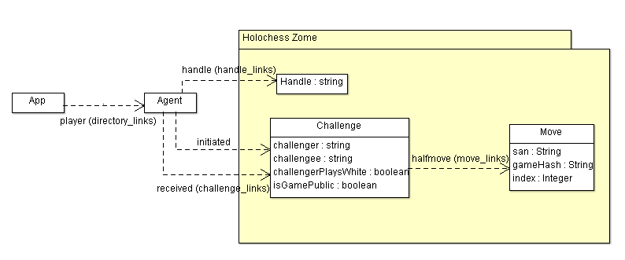

# Holochess Architecture

## DNA

### Entries

 - Handle: Agent's name
 - Challenge: Chess game's initial challenge request
 - Move: Chess move

### Links

- handle_links:
  - Binds handle to agent, tag: "handle"
- challenge_links:
  - Binds challenge to challenger, tag: "initiated"
  - Binds challenge to challengee, tag: "received"
- move_links:
  - Binds move to challenge, tag: "halfmove"
- directory_links:
  - Binds agent to App ("directory" anchor), tag: "player"

 

## Order of events

:warning: **DOCUMENTATION OUT OF DATE** :warning:

1. Challenge an Opponent

Send a challenge request to an opponent. Fields:
 - timestamp: Time where challenge has been made
 - challengee: Hash of opponent
 - challengerPlaysWhite: Boolean - self-explanatory
 - isGamePublic: Boolean - if true, challenge and moves are published in the dht, otherwise each entries are local to players sources chains only.

 2. challengee accepts challenge and plays first move (empty if challengee does not play white)

 3. Player sends chess move. Fields:
  - challengeHash: Hash of challenge request
  - SAN: string of SAN chess move

  ...

  4. Player sends endgame move (in SAN)
   - Claim victory
   - Claims draw
   - Declares forfeit

  5. Modify challenge to notify game is over and number of moves?

### Alternate order

Opponent must accept challenge, otherwise challenger can delete his challenge.

 

## Tests

Unit tests available

### Scenarios

 - challengeOneMove : Tests first moves of a two player public game.
 - PrivateChallenge : Tests first moves of a two player *private* game
 - threePlayers     : Tests multiple challenges at the same time with 3 different players